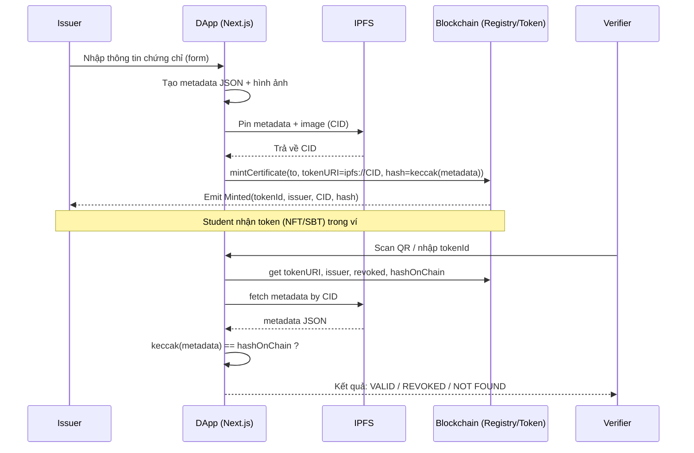
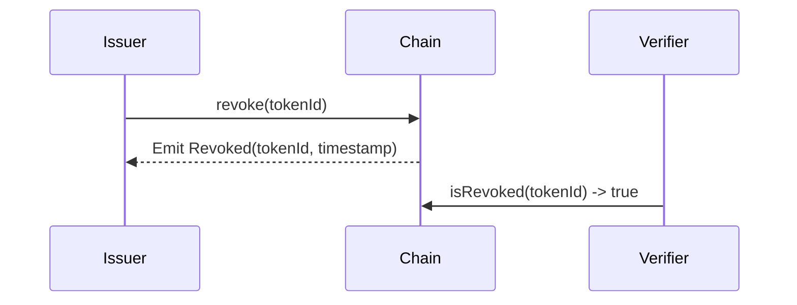

# Đồ án: Thiết kế và hiện thực một giải pháp cấp phát chứng chỉ số sử dụng công nghệ Blockchain

> Trường: Đại học Bách Khoa TP.HCM — Khoa Khoa học Máy tính  
> Mục tiêu: Xây dựng nguyên mẫu hệ thống phát hành, lưu trữ, xác minh chứng chỉ số theo kiến trúc hybrid (on-chain registry + off-chain metadata), dễ demo và có đường nâng cấp sang chuẩn W3C Verifiable Credentials.

---

## Mục lục
- [1. Khảo sát & phân tích hiện trạng](#1-khảo-sát--phân-tích-hiện-trạng)
  - [1.1 Bức tranh hệ sinh thái](#11-bức-tranh-hệ-sinh-thái)
  - [1.2 Cách tiếp cận kỹ thuật điển hình](#12-cách-tiếp-cận-kỹ-thuật-điển-hình)
  - [1.3 Ưu điểm & hạn chế (so sánh)](#13-ưu-điểm--hạn-chế-so-sánh)
  - [1.4 Bài học rút ra](#14-bài-học-rút-ra)
- [2. Nghiên cứu mô hình blockchain & lựa chọn kiến trúc](#2-nghiên-cứu-mô-hình-blockchain--lựa-chọn-kiến-trúc)
  - [2.1 So sánh Public vs Private vs Consortium](#21-so-sánh-public-vs-private-vs-consortium)
  - [2.2 Kiến trúc đề xuất](#22-kiến-trúc-đề-xuất)
  - [2.3 Lộ trình triển khai (MVP → nâng cấp)](#23-lộ-trình-triển-khai-mvp--nâng-cấp)
- [3. Thiết kế giải pháp cấp phát](#3-thiết-kế-giải-pháp-cấp-phát)
  - [3.1 Sơ đồ luồng phát hành–xác minh](#31-sơ-đồ-luồng-phát-hànhxác-minh)
  - [3.2 Mô hình dữ liệu JSON (off-chain) & lược đồ on-chain](#32-mô-hình-dữ-liệu-json-off-chain--lược-đồ-on-chain)
  - [3.3 Khung hợp đồng thông minh (Solidity skeleton)](#33-khung-hợp-đồng-thông-minh-solidity-skeleton)
  - [3.4 Phân quyền & vai trò](#34-phân-quyền--vai-trò)
  - [3.5 Nguyên tắc bảo mật & riêng tư](#35-nguyên-tắc-bảo-mật--riêng-tư)
---

## 1) Khảo sát & phân tích hiện trạng

### 1.1 Bức tranh hệ sinh thái
Ba “dòng” giải pháp chính đang tồn tại:
- **Blockchain-native credentials**: Blockcerts (MIT), OpenCerts (Singapore). Neo hash lên blockchain, xác minh công khai.
- **Badge/Certificate SaaS**: Accredible, Credly. Hướng UX & tích hợp, đôi khi có tuỳ chọn ghi nhận lên blockchain.
- **VC/SSI (Verifiable Credentials / Self-Sovereign Identity)**: Chuẩn W3C VC Data Model 2.0, dùng blockchain như trust registry / anchoring / revocation, dữ liệu chứng chỉ có chữ ký số và có thể công bố chọn lọc.

(Phụ cận) **POAP**: chứng nhận tham dự sự kiện (NFT), không thay thế văn bằng học thuật nhưng hữu ích cho quản trị cộng đồng.

### 1.2 Cách tiếp cận kỹ thuật điển hình
- **Blockchain-native (Blockcerts/OpenCerts)**: Issuer tạo chứng chỉ → đóng gói metadata → băm/neo hash on-chain. Holder giữ file/URI. Verifier đối chiếu chữ ký + hash.
- **Badge SaaS (Accredible/Credly)**: Quy trình cấp/giữ/verify trong nền tảng, có thể anchor lên chuỗi. Mạnh về UX, tích hợp LMS/CRM.
- **VC/SSI (W3C VC, EBSI)**: Mô hình Issuer–Holder–Verifier. Blockchain chủ yếu làm registry/anchoring. Mạnh về quyền riêng tư (selective disclosure).

### 1.3 Ưu điểm & hạn chế (so sánh)

| Tiêu chí | Blockchain-native | Badge SaaS | VC/SSI |
|---|---|---|---|
| Minh bạch/bất biến | Rất cao | Tuỳ nền tảng | Cao, on-chain footprint nhỏ |
| Quyền riêng tư (PII) | Cần cẩn trọng (metadata public) | Tương đối tốt | Rất tốt (selective disclosure) |
| Khả năng tương tác | Chuẩn mở nhưng hệ sinh thái hẹp | Khoẻ về tích hợp SaaS | Chuẩn W3C, liên thông rộng |
| Chi phí & mở rộng | Gas cao khi hàng loạt | Phí thuê bao | Mở rộng tốt (off-chain data) |
| Thu hồi/Revocation | Có thể làm on-chain | Theo workflow nền tảng | Có Status List chuẩn hoá |
| Độ chín thực tiễn | Đã áp dụng (SG, MIT) | Rất chín | Đang được EU/EBSI thúc đẩy |

### 1.4 Bài học rút ra
- **Không đưa PII lên chuỗi**: chỉ lưu hash/URI. Metadata lưu IPFS/Arweave, có thể mã hoá.
- **Cần cơ chế thu hồi rõ ràng**: trạng thái revoked kiểm tra được khi verify.
- **Bám chuẩn mở**: ERC-721/5192 (SBT) hoặc W3C VC 2.0.
- **Kiến trúc hybrid/consortium**: cân bằng chi phí & tin cậy, tận dụng public testnet cho demo.

---

## 2) Nghiên cứu mô hình blockchain & lựa chọn kiến trúc

### 2.1 So sánh Public vs Private vs Consortium

| Tiêu chí | Public | Private | Consortium |
|---|---|---|---|
| Minh bạch/bất biến | Rất cao | Thấp (phụ thuộc operator) | Cao vừa phải, tin cậy liên tổ chức |
| Chi phí/Gas | Có (tối ưu L2/batch) | Thấp/kiểm soát | Thấp–trung bình |
| Niềm tin bên thứ ba | Rất cao | Thấp | Cao hơn private |
| Quản trị & pháp lý | Khó can thiệp | Dễ tuân thủ nội bộ | Cân bằng, cần điều lệ chung |
| Trải nghiệm verify | Tốt (explorer/SDK) | Phụ thuộc hệ nội bộ | Cần cổng verify chung |

**Quyết định nhóm:**
- **Demo đồ án**: dùng **Public testnet** (Ethereum Sepolia / Polygon Amoy).  
- **Thực tế dài hạn**: hướng **Consortium/Hybrid** theo tinh thần EBSI + W3C VC.

### 2.2 Kiến trúc đề xuất
**Mục tiêu**: minh bạch, không rò PII, có revocation, verify 1 bước, dễ mở rộng VC/SSI.

**Thành phần**
1. **Smart Contract (Registry + Token)**: AccessControl (issuer list), lưu hash/CID, trạng thái revoke, ERC-721 hoặc ERC-5192 (SBT).
2. **Storage (IPFS/Arweave)**: metadata JSON + ảnh chứng chỉ; có thể mã hoá.
3. **Frontend (Next.js + wagmi/ethers)**: Issuer Dashboard, Student Profile, Verifier Page (QR/ID).
4. **Verification**: đọc on-chain state, fetch metadata theo CID, so khớp hash → kết luận.

### 2.3 Lộ trình triển khai (MVP → nâng cấp)
- **MVP**: ERC-721 + IPFS + Verify page + Revocation + QR.
- **Selling point**: chuyển **SBT (ERC-5192)**; tuỳ chọn **mã hoá metadata**.
- **Nâng cấp**: phát **W3C VC** song song, on-chain chỉ giữ issuer registry & revocation anchoring.

---

## 3) Thiết kế giải pháp cấp phát

### 3.1 Sơ đồ luồng phát hành–xác minh



**Revocation flow (rút gọn):**


### 3.2 Mô hình dữ liệu JSON (off-chain) & lược đồ on-chain

**Metadata JSON (IPFS) – không đưa PII lên chuỗi; nếu có PII, cân nhắc mã hoá:**
```json
{
  "type": "Certificate",
  "version": "1.0",
  "name": "Certificate of Completion - Blockchain 101",
  "description": "This certifies that the holder completed Blockchain 101.",
  "image": "ipfs://<CID>/certificate.png",
  "attributes": [
    { "trait_type": "Course", "value": "Blockchain 101" },
    { "trait_type": "Issued By", "value": "HCMUT" },
    { "trait_type": "Issued Date", "value": "2025-06-01" }
  ],
  "holder": {
    "wallet": "0xHOLDER...",
    "identifier": "student#hashedOrEncrypted"
  },
  "evidence": {
    "transcriptRef": "ipfs://<CID>/transcript_hash_or_encrypted",
    "signingAlg": "EIP-712",
    "issuerSig": "0x..."
  }
}
```

**Lược đồ on-chain (Registry + Token) – gợi ý:**
```solidity
struct CertificateInfo {
    address issuer;
    bytes32 metadataHash;   // keccak256(metadata JSON bytes)
    string tokenURI;        // ipfs://CID
    uint64 issuedAt;
    bool revoked;
}
mapping(uint256 => CertificateInfo) public certs; // tokenId -> info
```

**Hash tính ở frontend trước khi mint:**
```ts
const bytes = new TextEncoder().encode(JSON.stringify(metadata));
const hashHex = ethers.utils.keccak256(bytes);
```

### 3.3 Khung hợp đồng thông minh (Solidity skeleton)

```solidity
// SPDX-License-Identifier: MIT
pragma solidity ^0.8.20;

import "@openzeppelin/contracts/token/ERC721/ERC721.sol";
import "@openzeppelin/contracts/access/AccessControl.sol";
import "@openzeppelin/contracts/utils/Strings.sol";

/**
 * @title CertificateRegistry (ERC-721)
 * @notice MVP: NFT certificate + registry info + revocation.
 * For non-transferable behavior, switch to ERC-5192 or override _update() to block transfers.
 */
contract CertificateRegistry is ERC721, AccessControl {
    using Strings for uint256;

    bytes32 public constant ISSUER_ROLE = keccak256("ISSUER_ROLE");

    struct CertificateInfo {
        address issuer;
        bytes32 metadataHash;
        string tokenURI_;
        uint64 issuedAt;
        bool revoked;
    }

    uint256 private _tokenIdTracker;
    mapping(uint256 => CertificateInfo) private _certs;

    event Minted(uint256 indexed tokenId, address indexed to, address indexed issuer, string tokenURI, bytes32 metadataHash);
    event Revoked(uint256 indexed tokenId, address indexed issuer, uint64 revokedAt);

    constructor(address admin) ERC721("HCMUT Certificate", "HCMUTCERT") {
        _grantRole(DEFAULT_ADMIN_ROLE, admin);
    }

    // -------- Access control management --------
    function addIssuer(address account) external onlyRole(DEFAULT_ADMIN_ROLE) {
        _grantRole(ISSUER_ROLE, account);
    }
    function removeIssuer(address account) external onlyRole(DEFAULT_ADMIN_ROLE) {
        _revokeRole(ISSUER_ROLE, account);
    }

    // -------- Mint certificate --------
    function mintCertificate(address to, string calldata tokenURI_, bytes32 metadataHash) external onlyRole(ISSUER_ROLE) returns (uint256) {
        require(to != address(0), "Invalid recipient");
        require(metadataHash != bytes32(0), "Empty hash");

        uint256 tokenId = ++_tokenIdTracker;
        _safeMint(to, tokenId);

        _certs[tokenId] = CertificateInfo({
            issuer: msg.sender,
            metadataHash: metadataHash,
            tokenURI_: tokenURI_,
            issuedAt: uint64(block.timestamp),
            revoked: false
        });

        emit Minted(tokenId, to, msg.sender, tokenURI_, metadataHash);
        return tokenId;
    }

    // -------- Revoke --------
    function revoke(uint256 tokenId) external {
        require(_exists(tokenId), "Not found");
        CertificateInfo storage info = _certs[tokenId];
        require(hasRole(ISSUER_ROLE, msg.sender) && msg.sender == info.issuer, "Only issuer");
        require(!info.revoked, "Already revoked");
        info.revoked = true;
        emit Revoked(tokenId, msg.sender, uint64(block.timestamp));
    }

    // -------- Views --------
    function tokenURI(uint256 tokenId) public view override returns (string memory) {
        require(_exists(tokenId), "Not found");
        return _certs[tokenId].tokenURI_;
    }

    function getCertificate(uint256 tokenId) external view returns (
        address issuer,
        bytes32 metadataHash,
        string memory uri,
        uint64 issuedAt,
        bool revoked
    ) {
        require(_exists(tokenId), "Not found");
        CertificateInfo memory c = _certs[tokenId];
        return (c.issuer, c.metadataHash, c.tokenURI_, c.issuedAt, c.revoked);
    }

    // -------- Optional: make non-transferable (SBT-like) --------
    // If you want SBT behavior without ERC-5192, uncomment to block transfers:
    /*
    function _update(address to, uint256 tokenId, address auth) internal override returns (address) {
        // Block all transfers except mint (from == address(0)) and burn (to == address(0))
        address from = _ownerOf(tokenId);
        if (from != address(0) && to != address(0)) {
            revert("Non-transferable");
        }
        return super._update(to, tokenId, auth);
    }
    */
}
```

> **Ghi chú**: Nếu muốn **chuẩn SBT thật sự**, hãy chuyển sang **ERC-5192** (Minimal Soulbound). Ở skeleton trên, ta có tuỳ chọn chặn chuyển nhượng bằng cách override `_update`.

### 3.4 Phân quyền & vai trò
- **DEFAULT_ADMIN_ROLE**: thêm/bớt issuer, quản trị hợp đồng.
- **ISSUER_ROLE**: phát hành (mint) và thu hồi (revoke) chứng chỉ mình đã cấp.
- **Holder (Sinh viên)**: nhận token, trình QR để xác minh.
- **Verifier (Nhà tuyển dụng)**: chỉ đọc trạng thái on-chain + so khớp hash; không cần vai trò on-chain.

### 3.5 Nguyên tắc bảo mật & riêng tư
- **Không lưu PII on-chain**: chỉ hash metadata + CID. Nếu metadata chứa PII, cân nhắc **mã hoá** bằng khoá công khai của holder.
- **Revocation rõ ràng**: hàm `revoke(tokenId)` và cờ `revoked` phải được kiểm trong verify flow.
- **Quản trị khoá**: Issuer quản lý khoá ký & quyền ISSUER_ROLE an toàn; thêm issuer mới nên qua quy trình nhiều chữ ký (multisig) trong triển khai thực tế.
- **Audit & Test**: unit test cho mint, revoke, access control; fuzz test ở phần critical; kiểm tra hash khớp metadata.
